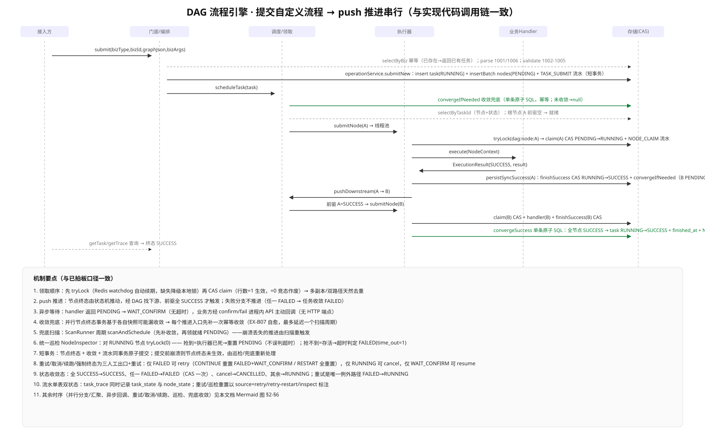
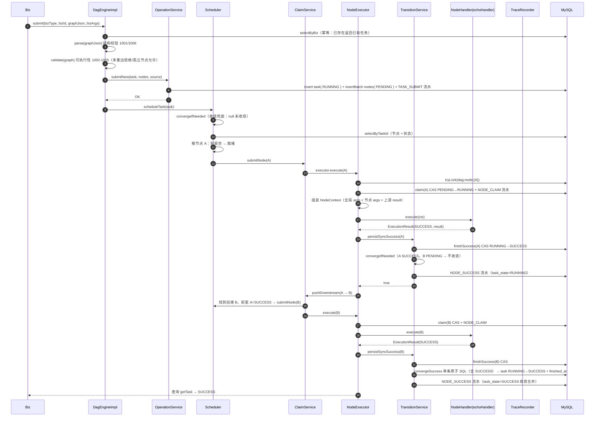
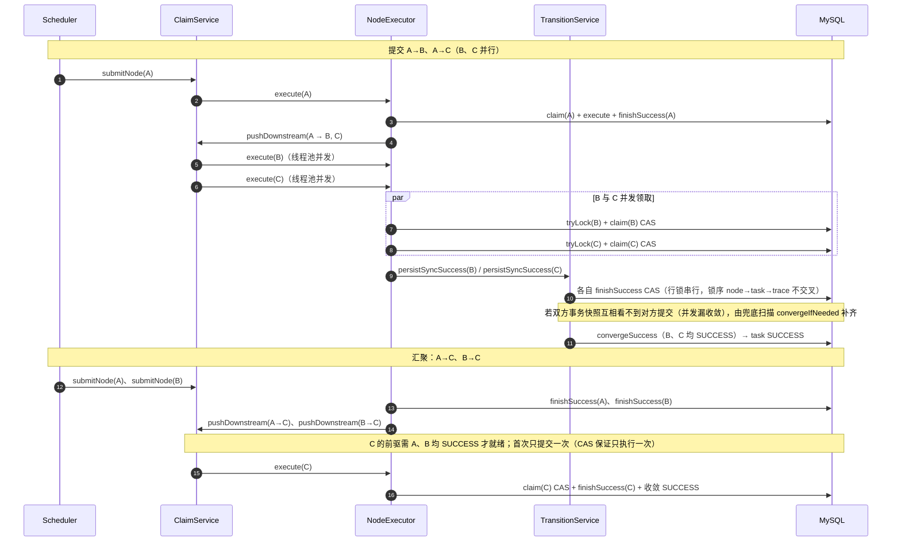
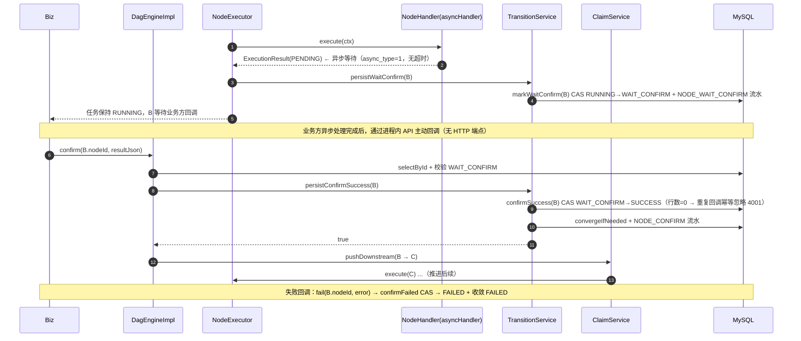
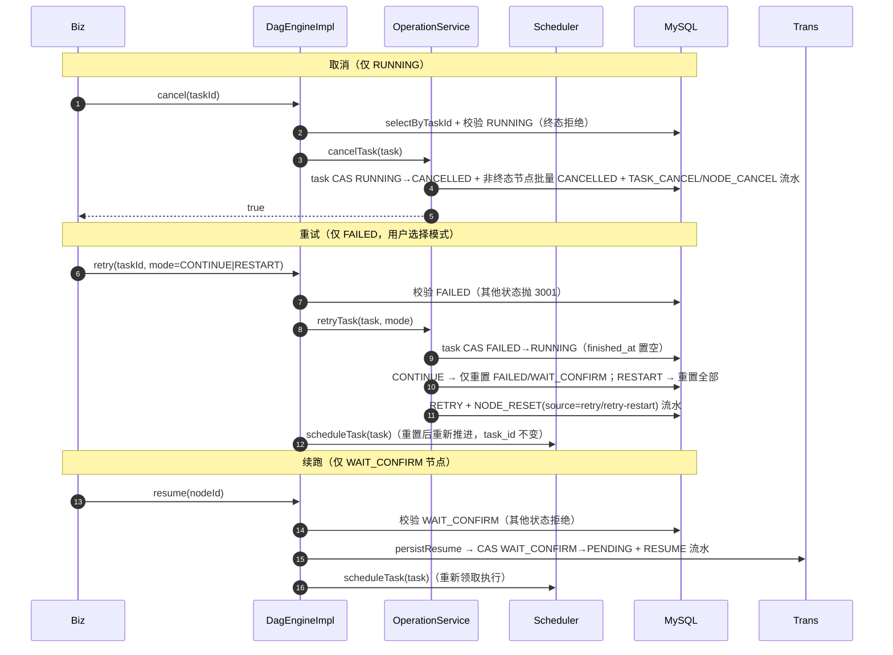
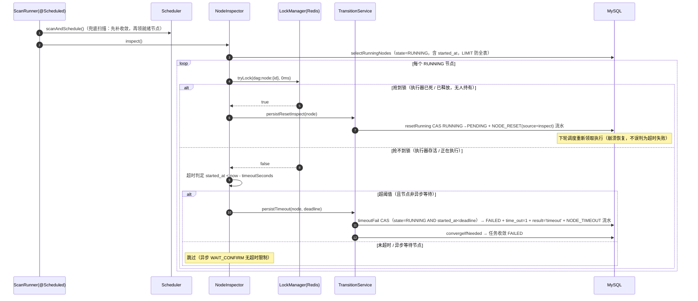
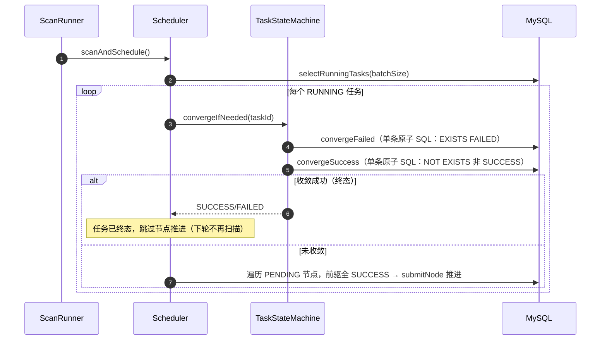

# 03 时序图（核心流程）

> 版本：v1.0（与 dag-core 已实现代码调用链逐字对应）
> 说明：本版时序图按「已落地的实现」绘制——push 推进 + 周期兜底扫描双路径、统一巡检器 NodeInspector、
> 短事务状态流转（节点终态 + 收敛 + 流水同事务）、三人工出口（cancel / resume / forceFinalize）。

## 0. 核心流程总览图（提交 → push 推进串行）

> 图源 `docs\03-时序图-v1.svg`（本地另有 png 渲染版）；并行/汇聚、异步回调、重试/取消/续跑、巡检、兜底收敛的详细时序见下文 Mermaid 图。

## 1. 对象图例

| 对象 | 说明 |
| --- | --- |
| Biz | 接入方（业务系统），调用 DagEngine 进程内 API |
| DagEngineImpl | 门面：参数校验、幂等、解析校验、编排控制操作 |
| OperationService | 提交落库 / 取消 / 重试 / 强制终态（任务 CAS + 节点批量 + 流水，短事务） |
| Scheduler | 调度器：提交后立即推进 + 周期兜底扫描（先补收敛，再领就绪节点） |
| ClaimService | 领取调度：提交执行任务到线程池（push 与兜底汇合同一领取） |
| NodeExecutor | 节点执行器：加锁 → CAS 领取 → 调 handler → 按结果分发 |
| TransitionService | 节点状态流转事务：终态写 + 收敛 + 流水原子提交 |
| NodeInspector | 统一巡检器：锁判定（重置 / 超时 FAILED），本地锁降级时关闭 |
| TraceRecorder | 流水写入（task_state + node_state 单表双状态） |

---

## 1. 提交自定义流程 → push 推进串行

关键点：
- **幂等**：submit 前 selectByBiz；并发提交由 UNIQUE(biz_type,biz_id) 兜底（DuplicateKeyException → 返回先提交者）。
- **领取顺序**：先 tryLock 再 CAS claim；行数=1 生效，=0 竞态作废（多副本/双路径天然去重）。
- **收敛**：任一节点终态触发；单条原子 SQL（NOT EXISTS 全 SUCCESS / EXISTS 任一 FAILED），并发下由「兜底扫描先补收敛」保证不漏（EX-B07 自愈）。

---

## 2. 并行分支 + 汇聚

---

## 3. 异步节点回调确认（WAIT_CONFIRM）

---

## 4. 人工控制：取消 / 重试 / 续跑

---

## 5. 统一巡检器 NodeInspector（崩溃恢复 + 超时判定）

关键点：
- **锁判定优先于超时判定**：tryLock(0) 成功 = 执行器已死 → **重置 PENDING**（绝不误判为超时失败）；失败 = 存活 → 才看超时。
- Redis 锁 watchdog 自动续期（30s 租期 / 10s 续期），慢执行不会丢锁被误重置。
- **Redis 缺失降级 LocalLockManager 时，inspect 直接 return**（本地锁无法感知其他实例，异常巡检自动关闭，防跨实例误重置）。

---

## 6. 兜底扫描补收敛（EX-B07 自愈路径）

> 该路径解决：并行节点终态事务基于各自一致性快照判定，可能双方都「看不到」对方提交而漏收敛；
> 兜底扫描在每个推进入口先补一次幂等收敛（单条 CAS），收敛漏触发最终自愈，最多延迟一个扫描周期。

---

## 7. 状态机总览（任务 / 节点）

| 对象 | 状态 | 迁移 | 触发 |
| --- | --- | --- | --- |
| task | RUNNING | → SUCCESS | 全节点 SUCCESS（CAS 单条 SQL） |
| task | RUNNING | → FAILED | 任一节点 FAILED（CAS） |
| task | RUNNING | → CANCELLED | cancel / forceFinalize(CANCELLED) |
| task | FAILED | → RUNNING | retry（唯一例外路径，finished_at 置空） |
| node | PENDING | → RUNNING | 领取：tryLock + CAS claim |
| node | RUNNING | → SUCCESS | handler SUCCESS / confirm |
| node | RUNNING | → FAILED | handler FAILED / fail 回调 / 超时（time_out=1） |
| node | RUNNING | → WAIT_CONFIRM | handler PENDING（无超时） |
| node | RUNNING | → PENDING | 巡检重置（执行器已死） |
| node | WAIT_CONFIRM | → PENDING | resume / retry(CONTINUE 含 WAIT_CONFIRM) |
| node | FAILED / WAIT_CONFIRM | → PENDING | retry 重置 |
| node | 任意非终态 | → CANCELLED | cancel / forceFinalize |
