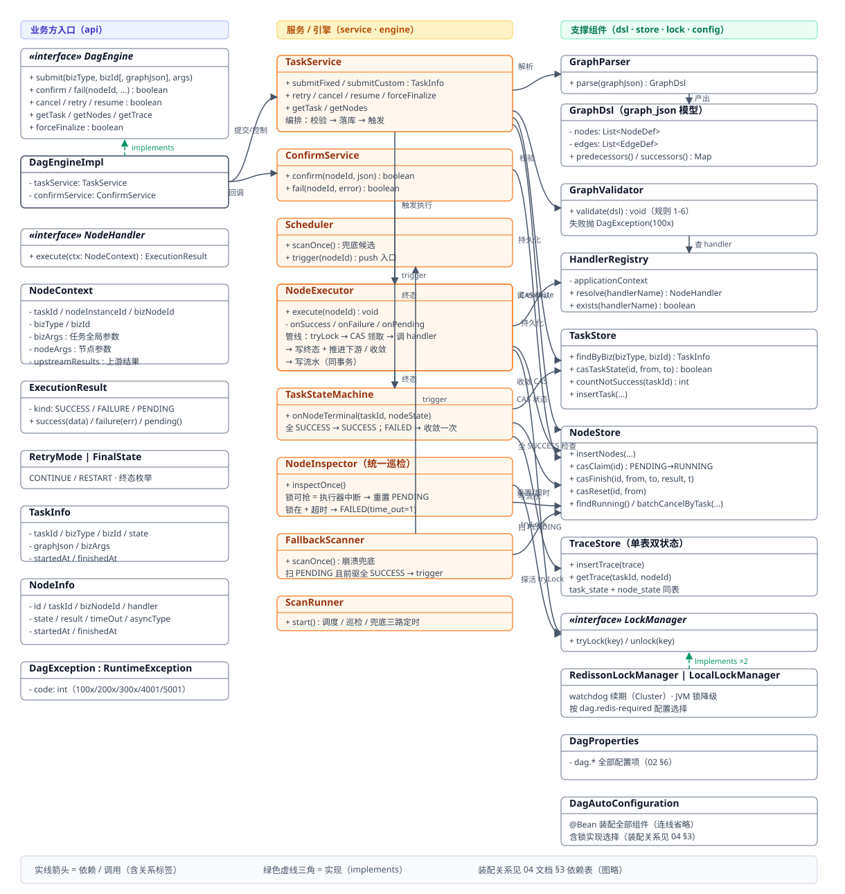
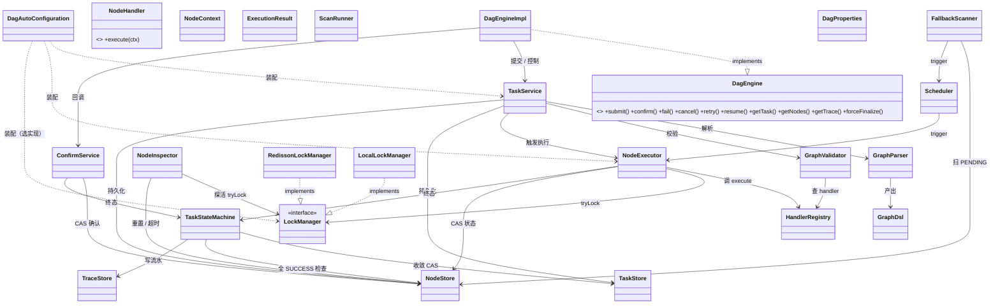

# 04 · 类图（设计稿 v0.1）

> 基线：`02-架构设计.md` / `05-数据库设计.md` / `06-接口设计.md`。
> 包结构：`com.example.dag`。JDK 8 + Spring Boot 2.5.x。

---

## 0. 类图全览



> 上图为核心类关系示意图：**实线箭头 = 依赖 / 调用（含关系标签），绿色虚线三角 = 实现（implements）**；装配关系见 §3 依赖表。矢量版：`04-类图-v2.svg`（同目录，本地另有 png 渲染版）。成员明细见 §2。

**机器可读版（支持 Mermaid 的编辑器可渲染，关系语义与上图一致）：**



---

## 1. 分层概览

```
┌─────────────────────────────────────────────────────────────┐
│ api       DagEngine(接口+实现) · NodeHandler · NodeContext ·  │
│           ExecutionResult · RetryMode · FinalState ·         │
│           TaskInfo · NodeInfo · DagException                 │
├─────────────────────────────────────────────────────────────┤
│ dsl/registry  GraphParser · GraphValidator · GraphDsl ·      │
│               NodeDef · EdgeDef · HandlerRegistry             │
├─────────────────────────────────────────────────────────────┤
│ store      TaskStore · NodeStore · TraceStore（CAS SQL + 流水）│
├─────────────────────────────────────────────────────────────┤
│ engine     ScanRunner · Scheduler · NodeExecutor ·           │
│            NodeInspector(统一巡检) · TaskStateMachine ·       │
│            FallbackScanner                                   │
├─────────────────────────────────────────────────────────────┤
│ lock       LockManager(接口) · RedissonLockManager ·         │
│            LocalLockManager                                  │
├─────────────────────────────────────────────────────────────┤
│ service    TaskService · ConfirmService                       │
├─────────────────────────────────────────────────────────────┤
│ config     DagProperties · DagAutoConfiguration              │
└─────────────────────────────────────────────────────────────┘
```

---

## 2. 核心类成员

### 2.1 api 层

**interface DagEngine**（业务方唯一入口）

| 方法 | 返回 | 说明 |
|---|---|---|
| submit(bizType, bizId, bizArgs) | TaskInfo | 提交固定流程 |
| submit(bizType, bizId, graphJson, bizArgs) | TaskInfo | 提交自定义流程 |
| confirm(nodeInstanceId, resultJson) | boolean | 回调确认（幂等） |
| fail(nodeInstanceId, error) | boolean | 回调失败（幂等） |
| cancel(taskId) | boolean | 取消（仅 RUNNING） |
| retry(taskId, mode) | TaskInfo | 重试（仅 FAILED） |
| resume(nodeInstanceId) | boolean | 续跑（仅 WAIT_CONFIRM） |
| getTask(taskId) | TaskInfo | 查询任务 |
| getNodes(taskId) | List\<NodeInfo\> | 查询节点 |
| getTrace(taskId, nodeId?) | List\<TraceEntry\> | 查询运行轨迹（单表双状态，时间升序） |
| forceFinalize(taskId, state) | boolean | 运维强制终态 |

**class DagEngineImpl implements DagEngine**
- 依赖：TaskService, ConfirmService

**interface NodeHandler**（业务方实现，@Component 注册）
- `ExecutionResult execute(NodeContext context)`

**class NodeContext**
- 字段：taskId, nodeInstanceId, bizNodeId, bizType, bizId, bizArgs(任务全局), nodeArgs(节点级), upstreamResults(上游结果)

**class ExecutionResult**
- 字段：kind(SUCCESS/FAILURE/PENDING), data, error
- 静态工厂：success(data) / failure(error) / pending()

**enum RetryMode**：CONTINUE / RESTART
**enum FinalState**：SUCCESS / FAILED / CANCELLED

**class TaskInfo**：taskId, bizType, bizId, state, graphJson, bizArgs, startedAt, finishedAt
**class NodeInfo**：id, taskId, bizNodeId, handler, state, result, timeOut, asyncType, startedAt, finishedAt

**class DagException extends RuntimeException**：code(int)

### 2.2 dsl / registry 层

**class GraphDsl**（graph_json 解析模型）
- 字段：nodes(List\<NodeDef\>), edges(List\<EdgeDef\>)
- 方法：predecessors() / successors() 邻接表

**class NodeDef**：bizNodeId, handler, asyncType, bizArgs
**class EdgeDef**：from, to

**class GraphParser**
- `GraphDsl parse(String graphJson)`

**class GraphValidator**
- 依赖：HandlerRegistry
- `void validate(GraphDsl dsl)`：规则 1-6，失败抛 DagException(100x)

**class HandlerRegistry**
- 依赖：ApplicationContext
- `NodeHandler resolve(String handlerName)` / `boolean exists(String handlerName)`

### 2.3 store 层（全部 CAS SQL，见 05）

**class TaskStore**
- findById / findByBiz(bizType, bizId) / insertTask
- casTaskState(taskId, fromState, toState) → boolean
- countNotSuccess(taskId) → int（收敛检查）

**class NodeStore**
- insertNodes(List\<NodeInfo\>)（提交时批量）
- findByTaskId(taskId) → List\<NodeInfo\>
- casClaim(id) → boolean（PENDING→RUNNING）
- casFinish(id, fromState, toState, result, timeOut) → boolean
- casReset(id, fromState) → boolean（异常重置/retry/resume 复用）
- findRunning() → List\<NodeInfo\>（巡检）
- batchCancelByTask(taskId, fromStates)（cancel）

**class TraceStore**（任务流水，单表双状态）
- insertTrace(trace)（与状态变更同短事务写入；任务级事件与节点级事件同表）
- getTrace(taskId, nodeId) → List\<TraceEntry\>（ORDER BY created_at ASC；nodeId 可空=全部）

**class TraceEntry**（model）
- 字段：id, taskId, nodeId, bizNodeId, eventType, taskState, nodeState, detail, createdAt

### 2.4 engine / lock 层

**class ScanRunner**
- 启动三路定时：调度 / 统一巡检 / 兜底扫描（ScheduledExecutor）

**class Scheduler**
- 依赖：NodeExecutor
- `void scanOnce()`（兜底路径：PENDING 且前驱全 SUCCESS → 领取）
- `void trigger(String nodeId)`（push 路径入口）

**class NodeExecutor**
- 依赖：HandlerRegistry, LockManager, NodeStore, TaskStateMachine
- `void execute(String nodeId)`：tryLock → casClaim → 调 handler → 三路分发
- onSuccess / onFailure / onPending（内部：写终态 + push 下游 / 收敛）

**class NodeInspector**（统一巡检器，合并 02 §4.4/§4.5）
- 依赖：LockManager, NodeStore
- `void inspectOnce()`：对 RUNNING 节点 tryLock——抢到=中断→casReset 回 PENDING；抢不到→超时判定→FAILED(time_out=1)

**class TaskStateMachine**
- 依赖：TaskStore, NodeStore
- `void onNodeTerminal(taskId, nodeState)`：SUCCESS→全节点检查→任务 SUCCESS；FAILED→任务 CAS FAILED

**class FallbackScanner**
- 依赖：NodeStore, Scheduler
- `void scanOnce()`：活跃任务 → 节点状态 → 内存判前驱 → Scheduler.trigger

**interface LockManager**
- `boolean tryLock(String key)` / `void unlock(String key)`

**class RedissonLockManager implements LockManager**：watchdog 自动续期（Cluster 模式）
**class LocalLockManager implements LockManager**：JVM ReentrantLock（Redis 缺失降级）

### 2.5 service / config 层

**class TaskService**
- 依赖：GraphParser, GraphValidator, TaskStore, NodeStore, NodeExecutor, LockManager
- submitFixed / submitCustom / retry / cancel / resume / forceFinalize / getTask / getNodes

**class ConfirmService**
- 依赖：NodeStore, TaskStateMachine
- confirm(nodeId, resultJson) / fail(nodeId, error)（仅 WAIT_CONFIRM，CAS 幂等）

**class DagProperties**：enabled, scheduler*, executorThreads, nodeTimeoutSeconds, lockLeaseSeconds, redisRequired 等（02 §6）

**class DagAutoConfiguration**：装配 DagEngineImpl / TaskService / ConfirmService / Scheduler / NodeExecutor / NodeInspector / FallbackScanner / LockManager（按 redis-required 选择实现）/ Store

---

## 3. 关键依赖关系

| 依赖方 | 被依赖 | 说明 |
|---|---|---|
| DagEngineImpl | TaskService, ConfirmService | 门面转调 |
| TaskService | GraphParser, GraphValidator, TaskStore, NodeStore, NodeExecutor, TraceStore | 提交/控制（写流水） |
| ConfirmService | NodeStore, TaskStateMachine, TraceStore | 回调确认（写流水） |
| Scheduler | NodeExecutor | 兜底扫描触发 |
| FallbackScanner | NodeStore, Scheduler | 崩溃兜底 |
| NodeExecutor | HandlerRegistry, LockManager, NodeStore, TaskStateMachine, TraceStore | 单节点执行管线（写流水） |
| NodeInspector | LockManager, NodeStore, TraceStore | 统一巡检（超时/重置写流水） |
| TaskStateMachine | TaskStore, NodeStore, TraceStore | 任务收敛（写流水） |
| DagEngineImpl.getTrace | TraceStore | 运行轨迹查询（单表双状态） |
| GraphValidator | HandlerRegistry | handler 可解析校验 |
| RedissonLockManager / LocalLockManager | LockManager | 实现选择（配置） |
| DagAutoConfiguration | 全部 | 依赖注入组装 |

---

## 4. 与 02/05/06 的对应

- 类职责与 02 §3 组件表一致；**TimeoutScanner + AbnormalScanner 在实现层合并为 NodeInspector**（05 §3.5 统一巡检器）
- SQL 全部收敛在 TaskStore / NodeStore（05 §3 草案）
- DagEngine / NodeHandler / NodeContext 签名与 06 §3 完全一致
